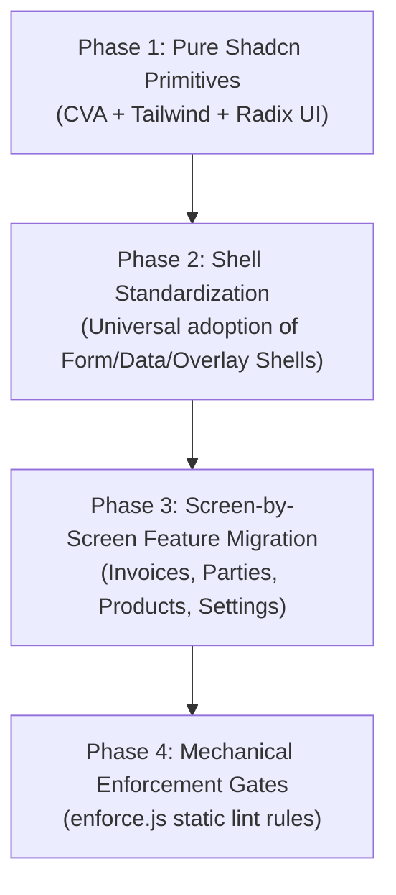

# 👑 Master Architecture Plan: Level 6 Shadcn UI & Shell System
**Plan ID:** `level6-shadcn-ui-system-master-plan`  
**Created:** 2026-09-26  
**Status:** DRAFT (Approved for execution)  
**Target Repository:** `HisaabPro` (Fintech Mobile & Desktop WebApp)

---

## 1. Executive Summary & The Level 6 Paradigm

### What is "Level 6" in UI Architecture?
In software engineering maturity models, **Level 6 (Axiomatic Elimination)** is the pinnacle of architectural design. It states:  
> *Rather than writing guidelines, best practices, or bug-fixes to solve UI inconsistencies, design the architecture so that the wrong UI is physically and structurally impossible to construct.*

| Level | Strategy | Typical Defects in Practice |
|---|---|---|
| **Level 1–2 (Ad-Hoc)** | Patching inline styles per screen (`style={{ paddingBottom: '80px' }}`). | Buttons overlap inputs, search icons sit over text, keyboards break layouts. |
| **Level 3–4 (Modular)** | Creating standard buttons and inputs, but letting individual pages build custom shells. | Modals cut off footers, scroll containers stop early, bottom navs hide CTAs. |
| **Level 5 (Design Tokens)** | Centralized CSS variables (`var(--color-primary-500)`). | Colors are consistent, but layouts and sticky button positioning still drift. |
| **Level 6 (Axiomatic Shells)** | **100% of screens inherit from unified Layout Shells (`FormPageShell`, `DataViewShell`, `OverlayShell`) with pure Shadcn CVA primitives.** | **Zero layout drift. Zero button clipping. Pinned sticky footers and safe-area insets guaranteed by construction.** |

---

## 2. Baseline Audit of Current UI System

### A. Primitive Inventory (`src/components/ui/`)
- **Strengths:** Radix UI primitives (`radix-ui`) are already present and powering components (`Drawer`, `Modal`, `Select`, `DropdownMenu`, `Tabs`, `Switch`, `Popover`).
- **Gaps & Defects Identified:**
  1. **Bespoke CSS Clutter:** Components mix Tailwind with legacy CSS files (`overlay.css`, `drawer-panel.css`, `invoice-product-search.css`, `components-ui.css`), causing CSS specificity clashes.
  2. **Icon & Text Overlap (e.g. Search Input):** In `ProductSearchInput`, a conflict between `.input` and `.product-search-field` reset left padding, causing the search icon to overlay user text (`Qasd`).
  3. **Outer Box Artifacts:** Wrapper classes like `.product-search-panel` added unwanted double borders and green backgrounds around standard search inputs.

### B. Layout & Navigation Inventory (`src/components/layout/`)
- **`AppShell`:** Root viewport, skip link, and global error boundaries.
- **`HeroPage`:** Emerald hero header for summary and detail pages.
- **`BottomActionBar`:** Handles sticky CTA elevation and mobile safe-area math.
- **`FormPageShell` & `DataViewShell`:** Newly introduced Level 6 primitives providing unified contracts for forms and list screens.

---

## 3. The Main Component Suite (Shadcn UI Standard)

All UI elements in HisaabPro are organized into **3 Standardized Tiers**:

```
┌────────────────────────────────────────────────────────────────────────┐
│                        MAIN COMPONENT SUITE                            │
├─────────────────────────┬─────────────────────────┬────────────────────┤
│ 1. Atomic Primitives    │ 2. Composite Controls   │ 3. Layout Shells   │
│ (Pure Shadcn/Radix/CVA) │ (Domain-Specific)       │ (Level 6 Shells)   │
├─────────────────────────┼─────────────────────────┼────────────────────┤
│ • Button                │ • SearchInput (Shadcn)  │ • FormPageShell    │
│ • Input / Textarea      │ • FilterChips           │ • DataViewShell    │
│ • Select / DropdownMenu │ • DateField / Picker    │ • OverlayShell     │
│ • Dialog / Modal        │ • SummaryTiles          │ • HeroPage         │
│ • Drawer / Sheet        │ • PartyAvatar           │ • PageContainer    │
│ • Switch / Checkbox     │ • TransactionRow        │ • BottomActionBar  │
│ • Badge / Card / Table  │ • BarcodeScanner        │                    │
└─────────────────────────┴─────────────────────────┴────────────────────┘
```

---

## 4. Phased Master Migration Roadmap



### Phase 1: Pure Shadcn Atomic Primitives Refactor
Replace all bespoke CSS styling in `src/components/ui/` with pure Tailwind + CVA (Class Variance Authority):
1. **`SearchInput` (Shadcn Command Standard):**
   - Centered magnifying glass icon (`left-3.5 top-1/2 -translate-y-1/2 text-gray-400 w-4 h-4`).
   - Clean text input with explicit `pl-10 pr-9 h-11 w-full rounded-xl border border-gray-200 bg-white text-sm shadow-xs`.
   - Clear button (`✕`) at `right-3 top-1/2 -translate-y-1/2`.
   - Dropdown popover with `rounded-xl shadow-lg border border-gray-100 bg-white p-1`.
2. **`Input` & `Textarea`:**
   - Single-border focus rings (`focus:ring-2 focus:ring-emerald-500 focus:border-transparent`).
   - Standard error labels and prefix/suffix icon slots.
3. **`Select` & `DropdownMenu`:**
   - Radix Select re-skinned with Tailwind elevation, popovers, and keyboard navigation.
4. **`Drawer` & `Modal` (`OverlayShell`):**
   - Pinned header (with drag handle on mobile) + `flex-1 min-h-0 overflow-y-auto` scrollable body + pinned sticky footer.

### Phase 2: Universal Layout Shell Adoption
1. **`FormPageShell` Adoption:**
   - Used by all create/edit pages: Pinned header + `max-w-2xl` form body + `pb-32` scroll clearance + sticky `BottomActionBar` connected via `form="page-form"`.
2. **`DataViewShell` Adoption:**
   - Used by all list/grid pages: Sticky search and filter chips + 4 UI states (Skeleton, Error, Empty, Data) + `BottomNav` clearance.
3. **`OverlayShell` Adoption:**
   - Used by all popups and quick action sheets.

### Phase 3: Screen-by-Screen Feature Migration Matrix

| Feature Area | Current Files | Target Architecture |
|---|---|---|
| **Invoicing & Sales** | `CreateInvoicePage.tsx`, `EditInvoiceForm.tsx`, `DraftInvoicesPage.tsx` | `FormPageShell` + Shadcn `SearchInput` + `InvoiceTotalsBar` (fixed) |
| **Customer & Vendor CRM** | `PartiesPage.tsx`, `PartyDetailPage.tsx`, `CreatePartyPage.tsx` | `DataViewShell` + `HeroPage` + `FormPageShell` |
| **Inventory & Products** | `ProductsPage.tsx`, `ProductDetailPage.tsx`, `CreateProductPage.tsx` | `DataViewShell` + `HeroPage` + `FormPageShell` |
| **Banking & Payments** | `PaymentsPage.tsx`, `RecordPaymentPage.tsx`, `DayBookPage.tsx` | `DataViewShell` + `OverlayShell` |
| **Settings & Administration** | `SettingsPage.tsx`, `GstSettingsPage.tsx`, `StaffPage.tsx` | `FormPageShell` |

### Phase 4: Mechanical Pre-Commit & Lint Enforcers (`scripts/enforce.js`)
Add automated static checks to guarantee zero regressions:
1. **`NO_INLINE_FIXED_BUTTONS`:** Blocks `className="fixed bottom-0..."` in feature files (must use `FormPageShell` or `BottomActionBar`).
2. **`NO_RAW_INPUTS_OR_BUTTONS`:** Blocks `<input>` or `<button>` outside `@/components/ui/*`.
3. **`MANDATORY_SHELL_USAGE`:** Verifies that every route page imports and renders a sanctioned shell (`FormPageShell`, `DataViewShell`, `HeroPage`, or `OverlayShell`).

---

## 5. Verification Matrix & Quality Gates

Every implementation step must pass all 3 quality gates:
1. **Type Cleanliness:** `npx tsc -b --noEmit` exits `0`.
2. **Design Freshness:** `node .claude/skills/hp-design/check-refs.mjs` exits `0`.
3. **Static Enforcement:** `node scripts/enforce.js` passes with zero blocking violations.
