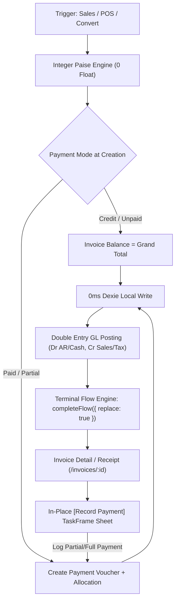

# 💎 Project VAJRA-LEDGER (वज्र लेजर)
### *The Level 6 Indestructible Invoice, POS & Double-Entry Payment Accounting Engine*

---

## 📌 Executive Summary
**Project VAJRA-LEDGER** is the Level 6 architecture blueprint for HisaabPro’s sales, point-of-sale (POS), billing, and double-entry payment accounting systems. It eliminates all classes of floating-point inaccuracies, surface form navigation escapes, duplicate transaction submissions, and offline data sync drifts.

---

## 🏛️ Core Architectural Axioms

### 1. Axiom of Atomic Ledgering (Paise Integer SSOT)
- **Rule:** Absolute zero floating-point arithmetic for financial calculations.
- **Storage:** All values stored as integers in **paise** ($1\text{ INR} = 100\text{ paise}$).
- **Formula:**
  $$\text{balanceDue} = \text{grandTotal} - \sum \text{PaymentAllocation.amount}$$
- **Status Computation:**
  - $\text{paidAmount} == 0 \implies \text{UNPAID}$
  - $0 < \text{paidAmount} < \text{grandTotal} \implies \text{PARTIALLY\_PAID}$
  - $\text{paidAmount} \ge \text{grandTotal} \implies \text{PAID}$

### 2. Axiom of Sub-Task Containment (No Form Escapes)
- Secondary workflows (e.g., Quick Add Party, Add Item, Record Payment against an open invoice) **MUST NEVER navigate to a full-page route**.
- Every sub-action executes within a **TaskFrame (Bottom Sheet / Modal)**, preserving parent form draft state and browser history.

### 3. Axiom of Ephemeral Node Purging (Zero Zombie History)
- Creation routes (`/invoices/new`, `/payments/new`, `/pos`) are ephemeral.
- On save or submit, navigation **MUST** use `completeFlow({ replace: true })` or `{ replace: true }` to transition directly to the terminal record (`/invoices/:id` or `/parties/:partyId`).
- Hardware Back, Edge-Swipe, and UI Back will never drop the user back into a submitted or blank form.

### 4. 0ms Local Reads & Offline-First Reconciler
- Mutations hit single-instance Entity Repositories in **Dexie / IndexedDB** first ($0\text{ms}$ optimistic local update).
- Transactional outbox persists operations and syncs to backend with cascade foreign-key remapping.

---

## 📋 Execution Roadmap

### 🔹 Milestone 1: `<RecordDocumentPaymentSheet>` (In-Place Payment Modal)
- **Location:** `src/features/invoices/components/RecordDocumentPaymentSheet.tsx`
- **Target Integrations:** `InvoiceDetailPage.tsx` and `PurchasesPage.tsx`
- **Capabilities:**
  - Auto-fills default amount with `document.balanceDue`.
  - Supports partial payment input ($0 < \text{amount} \le \text{balanceDue}$).
  - Payment modes: **Cash**, **UPI / QR**, **Bank Transfer / NEFT**, **Cheque**.
  - Reference number, date picker, notes.
  - Submits atomic `createPayment` with `{ allocations: [{ invoiceId: document.id, amount }] }`.

### 🔹 Milestone 2: Invoice Payment History & Allocation Timeline
- **Location:** `src/features/invoices/components/InvoicePaymentHistory.tsx`
- **Target Integration:** `InvoiceOverviewPanel.tsx`
- **Capabilities:**
  - Chronological breakdown of all partial payment vouchers allocated to the invoice.
  - One-tap link to view/print Payment Receipt Voucher (`/payments/:id/voucher`).
  - Progress bar showing Percentage Paid vs Due.

### 🔹 Milestone 3: POS Quick Billing & Tender Modal Parity
- **Location:** `src/features/pos/hooks/usePosCheckout.ts` & `src/features/pos/pages/PosPage.tsx`
- **Capabilities:**
  - Fast-tender actions: Exact Cash, Round Cash, UPI QR, Split Payment, or Credit.
  - Atomically records Sale Invoice + Payment Allocation.
  - Navigates to terminal receipt with `{ replace: true }`.

### 🔹 Milestone 4: Mechanical Verification & Zero-Drift Pre-Commit Gate
- Run full automated verification suite:
  - `npx tsc -b --noEmit` (0 errors)
  - Vitest invoice and payment test suites
  - `node scripts/enforce.js --all`
  - Pre-commit hooks (`[ssot]`, `[lint-raw-client]`)
