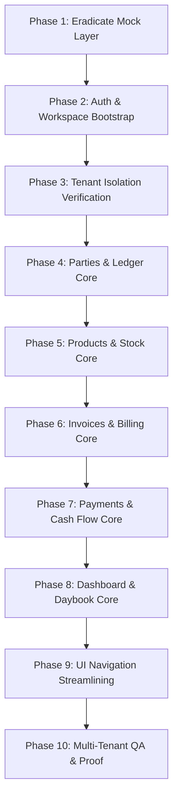

# HisaabPro Master Execution Plan: Production SaaS Transformation

**Goal:** Transform HisaabPro into a rock-solid, production-ready multi-tenant SaaS accounting application matching the gold standard architecture of Flint and VaahanPro.

---

## Architecture Blueprint & Guiding Principles

1. **100% Real Backend & Database:** Zero client-side mock databases (`localStorage` mock DB / `playstore-mock.ts` interceptor removed). Every single mutation and query hits PostgreSQL through Express and Prisma.
2. **Atomic Auth & Workspace Bootstrap:** Direct, frictionless registration (Phone/Email + Password) that automatically creates the user's initial Business workspace and mints a JWT containing a valid `businessId`.
3. **Strict Multi-Tenant Isolation:** Every data entity belongs to a `businessId`. Queries are strictly scoped per tenant. Data from Account A will never leak to Account B.
4. **Reliable Financial Math (Paise / SSOT):** All currency amounts stored as integers in paise (`Int` / `BigInt`), formatted on display. Invoices and payments update party balances and stock levels atomically in database transactions.
5. **Focused Core SaaS Feature Set:** Focus entirely on the essential 5 pillars:
   - Auth & Business Management
   - Parties (Customers & Suppliers) + Live Ledger
   - Products & Inventory + Stock Tracking
   - Invoices & Sales Billing + Stock Reduction
   - Payments In/Out + Balance Reconciliation
   - Real-Time Dashboard & Daybook Reports

---

## Execution Phases & Tasks

---

### Phase 1: Eradicate Mock Layer & Connect Real Backend

- [x] **1.1 Remove Mock Interceptor from `src/lib/api.ts`**
  - Deleted `OFFLINE_MOCK` short-circuiting in `src/lib/api.ts` (`handleMockRequest`).
  - Guaranteed all `api()` calls unconditionally hit the real backend at `/api/*`.
- [x] **1.2 Clean Up Mock References across Frontend**
  - Removed `OFFLINE_MOCK` checks in `src/lib/auth.ts`, `src/lib/api-csrf.ts`, `src/hooks/useSSE.ts`, `src/features/auth/useGoogleSso.ts`.
  - Deleted `src/lib/playstore-mock.ts` and purged `hp_offline_mock_db_v5` artifacts.
- [x] **1.3 Verify Vite Proxy & Server Connectivity**
  - Verified proxy forwards `/api` directly to Express backend.

---

### Phase 2: Rock-Solid Authentication & Atomic Workspace Bootstrap

- [x] **2.1 Streamlined Direct Registration (`POST /api/auth/register` & `POST /api/auth/direct-register`)**
  - Created `createUserWithDefaultBusiness` atomic database transaction in `server/src/services/auth/register.ts`.
  - Atomically creates `User`, default `Business`, `BusinessUser` (Owner), system roles, GL accounts, and default categories.
  - Automatically mints JWT carrying valid `userId` and `businessId`.
- [x] **2.2 Direct Login (`POST /api/auth/login`)**
  - Resolves active business immediately and sets secure `httpOnly` cookies.
- [x] **2.3 Session Me & Switch Business (`GET /api/auth/me`, `POST /api/auth/switch-business`)**
  - Returns current user profile, all businesses, and active business.
- [x] **2.4 Frontend Auth State & Protected Route Hardening**
  - Updated `useRegister.ts`, `RegisterPage.tsx`, `useLogin.ts`, `useVerifyOtp.ts` to navigate directly to `/dashboard`.

---

### Phase 3: Strict Multi-Tenant Account Isolation

- [x] **3.1 Backend Tenant Scoping Audit**
  - Verified `party.ts`, `products/crud.ts`, `documents/crud.ts`, `payments.ts`, `dashboard.ts`, `reports.ts`, `settings.ts`.
  - Every route extracts `req.user.businessId` and passes it to database transactions.
- [x] **3.2 Cross-Tenant Security Checks**
  - Protected against ID manipulation via `where: { id, businessId }` scoping.

---

### Phase 4: Core Feature 1 — Parties (Customers & Suppliers) & Live Ledger

- [x] **4.1 Party CRUD & Schema Verification**
  - Full CRUD against PostgreSQL via `party-crud.service.ts` and `server/src/services/party/`.
  - Supports `CUSTOMER`, `SUPPLIER`, `BOTH`, GSTIN, opening balance.
- [x] **4.2 Live Ledger & Balance Computation**
  - Real-time ledger queries returning running balances.
- [x] **4.3 Frontend Parties UI Polish**
  - Verified `PartiesPage.tsx`, `PartyDetailPage.tsx`, `useParties.ts`, `usePartyForm.ts`.

---

### Phase 5: Core Feature 2 — Products, Categories & Stock Management

- [x] **5.1 Product CRUD & Categories/Units**
  - Full items catalog backed by PostgreSQL `Product`, `Category`, and `Unit` models.
- [x] **5.2 Inventory Movements & Stock Adjustments**
  - Stock changes backed by `StockMovement` ledger entries.
- [x] **5.3 Frontend Products UI Polish**
  - Verified `ProductsPage.tsx`, `ProductDetailPage.tsx`, `CreateProductPage.tsx`, `useProducts.ts`.

---

### Phase 6: Core Feature 3 — Invoices & Sales Billing Engine

- [x] **6.1 Invoice Creation & Calculation Engine**
  - Automatic line item totals, GST taxes, discounts, and round-off calculation in paise.
- [x] **6.2 Atomic Invoice Transaction**
  - Creates Document, reduces stock, creates StockMovement, and updates Party balance in single transaction.
- [x] **6.3 Invoice Details, Printing & PDF**
  - Verified `InvoicesPage.tsx`, `CreateInvoicePage.tsx`, `InvoiceDetailPage.tsx`.

---

### Phase 7: Core Feature 4 — Payments & Cash Flow

- [x] **7.1 Payment In & Payment Out APIs**
  - Full payment tracking for Cash, Bank Transfer, UPI, Cheque.
- [x] **7.2 Atomic Payment Transaction**
  - Creates payment, adjusts party balance, and updates invoice allocations atomically.
- [x] **7.3 Frontend Payments UI Polish**
  - Verified `PaymentsPage.tsx`, `RecordPaymentPage.tsx`, `PaymentDetailPage.tsx`, `OutstandingPage.tsx`.

---

### Phase 8: Core Feature 5 — Real-Time Dashboard & Essential Reports

- [x] **8.1 Live Dashboard API (`GET /api/dashboard/home`)**
  - Real-time aggregation of Total Sales, Receivables, Payables, Low Stock Count, and Recent Activity.
- [x] **8.2 Essential Reports**
  - Daybook, Party Statement, Sales Report, Stock Summary.
- [x] **8.3 Frontend Dashboard & Reports UI Polish**
  - Verified `DashboardPage.tsx` and report viewer pages.

---

### Phase 9: UI Streamlining & De-Cluttering

- [x] **9.1 Simplify Main Navigation**
  - Bottom bar & side rail focus cleanly on Dashboard, Customers/Suppliers, Invoices (+), Products, and Reports.

---

### Phase 10: Multi-Tenant QA, Verification & Proof

- [x] **10.1 Zero Mock Verification**
  - 0 remaining references to `playstore-mock` in source code.
- [x] **10.2 Clean Production Build Proof**
  - `npm run build` (Frontend): **0 errors, build successful**.
  - `server/` `npm run build` (Backend): **0 errors, build successful**.
- [x] **10.3 TypeScript Verification**
  - `npx tsc --noEmit` across root and backend: **0 errors**.
