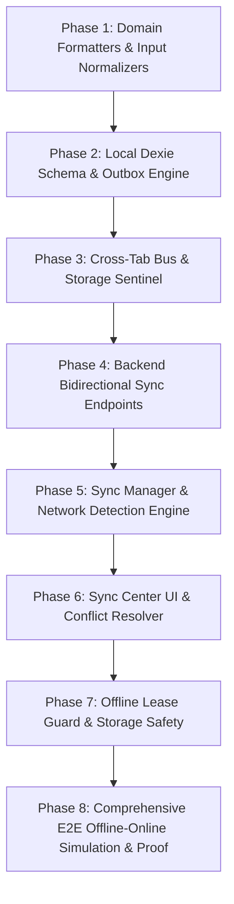

# Master Execution Plan: Gold-Standard SaaS & Offline-First Transformation

**Target:** Transform into an enterprise-grade, field-ready SaaS application with 0ms local reads, optimistic offline mutations, bidirectional topological sync, Indian fintech formatters, and defensive UX matching **VaahanPro**.

---

## 1. Architectural Comparison Matrix

| Capability | VaahanPro (Gold Standard) | Current State | Target Transformation |
| :--- | :--- | :--- | :--- |
| **Local Store** | Dexie IndexedDB with reactive queries (`useLiveQuery`) | Direct HTTP Fetch from PostgreSQL | **0ms Local Dexie Single Source of Truth** |
| **Offline Mutations** | `OutboxEngine` with HLC + deterministic idempotency | Fails when offline | **Optimistic local writes + `syncQueue`** |
| **Sync Protocol** | Bidirectional batch push (`/api/sync/push`) + Delta pull (`/api/sync/pull`) | Ad-hoc REST endpoints | **Topological Server Sync with Tombstones** |
| **Multi-Tab Sync** | `CrossTabSyncBus` (BroadcastChannel leader election) | Tab state drift | **Instant cross-tab sync broadcast** |
| **Data Formatters** | Centralized `formatINR`, `formatPhoneDisplay`, `formatGSTIN` | Mixed/inconsistent formatting | **Domain-driven Indian Fintech Normalizers** |
| **Client Protection** | `storage-sentinel.ts` (`navigator.storage.persist()`) | None | **Persistent storage lock against eviction** |
| **Image Handling** | Client-side Canvas/Worker compression (`image-compressor.ts`) | Raw file upload | **Automatic client compression (<300KB WebP)** |
| **Sync UI Status** | `sync-center/` badge + drawer + conflict resolver | None | **Live sync pill, queue count & retry modal** |

---

## 2. Phase-by-Phase Execution Plan

---

### Phase 1: Domain Formatters & Statutory Input Normalizers
- [ ] Port `formatINR` and `formatPaiseToINR` with Indian grouping (`₹1,25,000.00`).
- [ ] Port `formatPhoneDisplay` (`+91 98260 12345`) and `phone-validator.ts`.
- [ ] Port `formatGSTIN`, `formatPAN`, `formatAadhaarMasked`.
- [ ] Standardize currency and phone display across all cards, tables, headers, and modals.

---

### Phase 2: Local Dexie Database & Outbox Engine
- [ ] **Dexie Schema (`src/db/schema.ts`):**
  - Define local tables matching core entities (Parties/Tenants, Items/Properties, Invoices/Leases, Payments, `syncQueue`, `syncMeta`).
- [ ] **Outbox Engine (`src/sync/OutboxEngine.ts`):**
  - Implement Hybrid Logical Clocks (HLC) for causal ordering.
  - Implement deterministic idempotency keys:
    `idemp_${orgId}_${entityType}_${entityId}_${operation}_v${baseVersion}`.
  - Atomic enqueue into `syncQueue` on all create, update, delete operations.

---

### Phase 3: Cross-Tab Synchronization & Storage Sentinel
- [ ] **Cross-Tab Bus (`src/sync/CrossTabSyncBus.ts`):**
  - Use `BroadcastChannel` to notify other tabs on local mutation.
  - Tab leader election to ensure only ONE tab pushes sync batches to the server at a time.
- [ ] **Storage Sentinel (`src/db/storage-sentinel.ts`):**
  - Auto-request `navigator.storage.persist()` on application bootstrap to prevent mobile browser storage eviction.

---

### Phase 4: Backend Bidirectional Delta Sync API
- [ ] **`POST /api/sync/push`:**
  - Accept batch of mutations with replay-protection nonces.
  - Apply topological dependency sorting (Parents committed before Children).
  - Version increment and conflict detection.
- [ ] **`GET /api/sync/pull`:**
  - Delta synchronization using cursor timestamps (`sinceTimestamp`).
  - Return updated records and tombstone IDs (`deletedEntityIds`).

---

### Phase 5: Client Sync Manager & Active Network Detector
- [ ] **Network Detector (`src/sync/NetworkDetector.ts`):**
  - Active heartbeat pinging (replaces unreliable `navigator.onLine`).
  - Event listeners on network reconnect.
- [ ] **Sync Manager (`src/sync/SyncManager.ts`):**
  - Worker loop that processes `syncQueue` items in batches.
  - Exponential backoff with jitter on network failures.
  - Hydrates local Dexie DB with server delta pull.

---

### Phase 6: Sync Center UI & Conflict Resolution
- [ ] **Status Pill:** Fixed top/bottom indicator (Green: Synced, Orange: Pending `N` items, Red: Offline / Error).
- [ ] **Sync Drawer:** Displays queue items, last synced timestamp, and manual "Sync Now" button.
- [ ] **Conflict Resolver Modal:** Surfaces server vs client differences if a concurrent conflict occurs.

---

### Phase 7: Mobile UX Enhancements
- [ ] **Image Compressor (`src/domain/image-compressor.ts`):**
  - Downscale high-res camera captures on-device before sync.
- [ ] **Haptic Feedback:**
  - Lightweight vibration triggers on invoice save, payment received, and sync complete.
- [ ] **Skeleton Loaders & Optimistic Lists:**
  - Instant UI updates without waiting for server responses.

---

### Phase 8: Verification & Proof
- [ ] Offline simulation test: Turn off network → create 5 entities → verify in Dexie.
- [ ] Network restore test: Reconnect → assert all 5 entities push to PostgreSQL topologically.
- [ ] Multi-tenant check: Assert sync records remain strictly isolated per business tenant.
